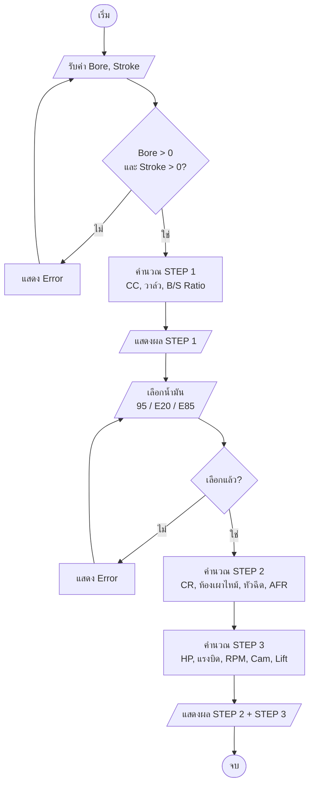
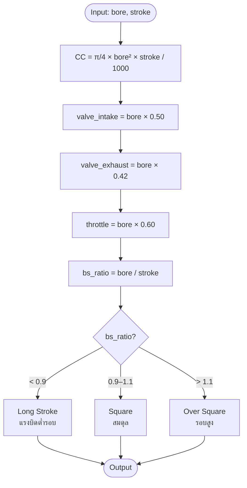
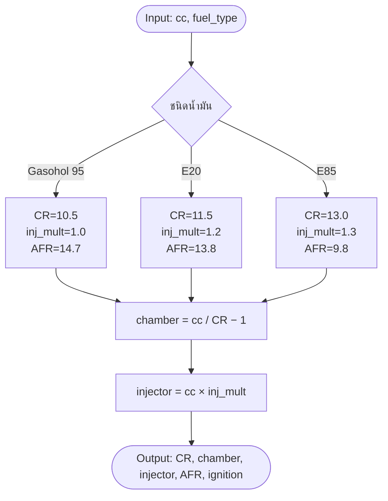
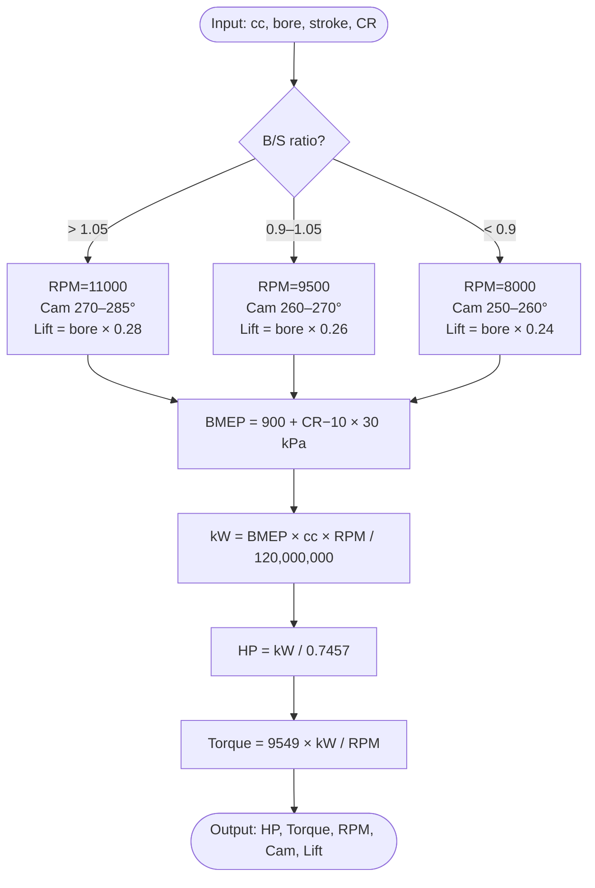

# Engine Calculator — Flowchart

## 1. Flowchart รวม (Mermaid)



## 2. Flowchart รายฟังก์ชัน

### STEP 1 — ข้อมูลพื้นฐานเครื่องยนต์



### STEP 2 — น้ำมันเชื้อเพลิง



### STEP 3 — ประมาณกำลัง



## 3. ASCII Flowchart (เผื่อ Mermaid render ไม่ขึ้น)

```
┌─────────────┐
│   START     │
└──────┬──────┘
       │
       ▼
┌─────────────────────┐
│ Input: Bore, Stroke │
└──────┬──────────────┘
       │
       ▼
   ╱───────────╲
  ╱ ตรวจสอบค่า  ╲ ──── No ──▶ แจ้ง Error
   ╲ > 0 ?     ╱
    ╲─────────╱
       │ Yes
       ▼
┌─────────────────────────────────┐
│ STEP 1: คำนวณ                   │
│  • CC = π/4 × b² × s / 1000     │
│  • วาล์ว (×0.50, ×0.42, ×0.60)  │
│  • B/S Ratio → Long/Square/Over │
└──────┬──────────────────────────┘
       │
       ▼
┌─────────────────────┐
│ เลือกน้ำมัน          │
│  95 / E20 / E85     │
└──────┬──────────────┘
       │
       ▼
┌──────────────────────────────────┐
│ STEP 2: คำนวณตามน้ำมัน           │
│  • CR (10.5 / 11.5 / 13.0)       │
│  • ห้องเผาไหม้ = cc / (CR − 1)    │
│  • หัวฉีด = cc × (1.0/1.2/1.3)   │
│  • AFR, จุดระเบิด                │
└──────┬───────────────────────────┘
       │
       ▼
┌──────────────────────────────────────┐
│ STEP 3: ประมาณกำลัง                  │
│  • BMEP = 900 + (CR−10) × 30         │
│  • kW = BMEP × cc × RPM / 120,000,000│
│  • HP = kW / 0.7457                  │
│  • Torque = 9549 × kW / RPM          │
└──────┬───────────────────────────────┘
       │
       ▼
┌─────────────┐
│   แสดงผล    │
└──────┬──────┘
       │
       ▼
┌─────────────┐
│    END      │
└─────────────┘
```

## 4. สูตรหลัก (Summary)

| รายการ | สูตร |
|--------|------|
| ความจุกระบอกสูบ | `CC = π/4 × bore² × stroke / 1000` |
| วาล์วไอดี | `bore × 0.50` |
| วาล์วไอเสีย | `bore × 0.42` |
| ลิ้นเร่ง | `bore × 0.60` |
| B/S Ratio | `bore / stroke` |
| ห้องเผาไหม้ | `cc / (CR − 1)` |
| หัวฉีด | `cc × inj_mult` |
| BMEP | `900 + (CR − 10) × 30  kPa` |
| Power | `kW = BMEP × cc × RPM / 120,000,000` |
| Horsepower | `HP = kW / 0.7457` |
| Torque | `Nm = 9549 × kW / RPM` |
